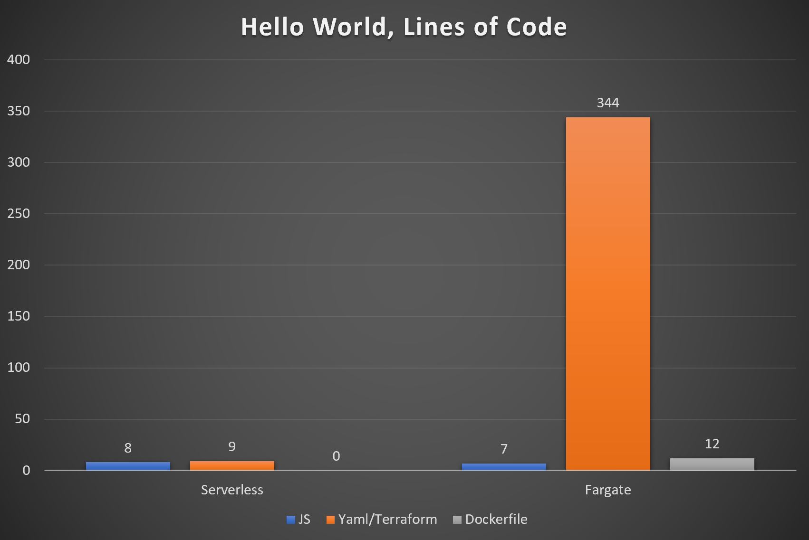

<!--
Checklist:
* Demo1 stack is removed and folder deleted
* Demo1 command line open in C:\GitHub\WhyNotServerlessForEverything with commands in buffer
* C:\GitHub\WhyNotServerlessForEverything folder open in FileExplorer
* Make notes window tall enough
-->

<!-- .slide: data-background="images/architecture.jpg" -->

# Why Not Serverless for Everything?

Note:
* Using serverless more and more recently
* Been good for our team, got us wondering.. "why not..."
* Anyone using serverless?
* Warning: Opinionated, but data to back up
* Ask questions anytime

---

<!-- .slide: data-background="images/guage.jpg" -->

# What is serverless?

Note:
* Term popularised by Lambda (FaaS)
* AKA: PaaS, Fully managed
* Servers hidden, Reliable, Scaleable, Pay as you go
* Not just Code:  Database, storage, notifications, queues.
* Managed cluster vs Platform

---

# FaaS architecture

<!-- .slide: data-background="images/lambda.png" -->

Note:
* Small functions that respond to events

---

# FaaS architecture

| | | |
| - | - | - |
| API Gateway | AWS IoT | Alexa Skills Kit |
| Alexa Smart Home | CloudFront | CloudWatch Events |
| CloudWatch Logs | CodeCommit | Cognito Sync Trigger |
| DynamoDB | Kinesis | S3 |
| SNS | SQS | |

Note:
* Lots of triggers available
* Can also invoke lambdas directly, though probably avoid

---

<!-- .slide: data-background="images/core.jpg" -->

# Core or Context

Note:
* Why serverless?
* Geoffrey Moore
* Differentiating vs necesarry
* Invest vs outsource
* Serverless to outsource

---

<!-- .slide: data-background="images/black.png" -->

### Satisfaction

Note:
* Why?  Satisfying to be:
* Delivering value
* Writing code
* Solving new, interesting problems
* Learning hip, cv-friendly technologies

---

<!-- .slide: data-background="images/money.jpg" -->

# The money

Note:
* Spend less on:
* Development
* Running costs
* Maintenance
* Training
* Opportunity cost
* Staff turnover.. possibly

---

<!-- .slide: data-background="images/change.jpg" -->

Note:
* Easier to effect change by:
* Using battle-tested, well understood technologies
* Reducing quantity of infra code
* Encouraging single responsibility

---

# How much less code is there, exactly?

---

<!-- .slide: data-background="images/serverless-framework.png" -->

Note:
* Anyone used it?
* Makes FaaS based apps easier
* Deployment, configuration
* Many languages, many providers
* AWS: Cloud formation
* Azure: Resource Manager templates
* Quick to get started

---

# Demo: Hello world on AWS

Note:
* `> mkdir demo1`
* `> cd demo1`
* `> npm init -y`
* `> npm i serverless --save-dev`
* `> npx sls create -t aws-nodejs`
* `> code .`
* `> awsj`
* `> npx sls deploy`, Explore code
* `> npx sls invoke -f hello`
* Add events, - http, path & method
* deploy, curl

---

# Next best?  Fargate

<!-- .slide: data-background="images/fargate.jpg" -->

Note:
* Anyone used it?
* ECS, but without need to manage EC2 instances

---

# Closer look: Fargate, hello world endpoint

Note:
* Tried simplest
* Terraform, node, expressjs
* 14 hours
* Open: VSCode, Show: JS, terraform
* Creating fargate cluster in Console offers to auto-create VPC

---

Note:
* Makes the point clearly
* In practise VPC, etc, shared, but..
* More resources will add more, but..
* Plugins & modules
* YAML more concise
* sls YAML better experience than Terraform
* sls deploy faster, less
* sls no docker, updating images, 755MB etc

---

# Is it mature enough for use in production?

---

Note:
* Also, Azure Websites GA (now webapps) June 2013
* Google App engine GA Sept 2011

---

# Is it fast enough for use for an API?

---

(Source: Yun Zhi Lin)

Note:
* F# dotnetcore2 first
* C# dotnetcore2 second
* All one millisecond or less
* Existing benchmarks measure execution time

---

# Closer look: Latency benchmark

Note:
* Invocation time
* Created lambda to test
* eu-west-1 (Ireland)
* DynamoDB, S3, Lambda (various), Fargate 512MB 2 containers 256 CPU
* `> cd ..\aws-experiments`
* `> code .`  Show: latencyTest code
* `> npm run l`

---

Note:
* Invoke ~19ms, thaw overhead
* 20ms overhead using lambda for https
* 9ms overhead of API Gateway over lambda invoke
* 15ms extra overhead for using authorizer lambda
* Fargate http times impressive
* Httpstandard consistently faster
* InvokeAsync is slow

---

# But what about cold-starts?

---

Note:
* First request, new execution context / container
* Subsequent requests *may* reuse
* Disposed after idle, ~45 minutes

---

(Source: Burning Monk)

Note:
* Example of cold-start
* Requests in series

---

Note:
* Per concurrent execution
* Keep warm
* Azure functions concurrency

---

# Closer look: Coldstarts benchmark

Note:
* Show: coldStartTest code
* `> npm run c`

---

(Source: Nathan Malishev)

Note:
* Python fastest in all cases
* More memory = faster instance = faster cold start
* .NET may be faster now with release of dotnet core 2 on AWS

---

# How easily does it scale?

---

### Lambda scaling

(Source: Amazon)

Note:
* Scales without config
* Immediate Concurrency Increase, 3000 in Ireland
* 500 / minute after
* Up to account limit (1000 by default, soft limit)
* May need to think about keep warm

---

(Source: Remy DeWolf)

Note:
* Still ECS
* Needs auto-scaling policy
* Min, desired, maximum tasks
* Scale up/down rules
* ~3 minutes to add a task/container instance
* Max 1 per second
* Lots of options for memory, cpu

---

# And Azure performance?

---

(Source: Mikhail Shilkov)

Note:
* Tried to include Azure
* Deploy issues with serverless-azure
* Perhaps improved now GA
* Execution context takes parallel requests
* To test further, particularly:
  * AppService plan
  * Websites

---

# Serverless first?

Note:
* Best approach depends on use-case
* But, serverless first?
* Especially for startups
* Can always refactor

---

# How easy is it to move cloud provider?

---

Note:
* Common theme, scared of vendor lock in
* Do not build your own container platform
* Locked in to own slow vendor
* Lowest common denominator is sad

---

Note:
* Pick language supported on others providers
* Stick to features that are available elsewhere
* Tell the business not to worry

---

Note:
* Can move container easily
* But still needs to be plumbed in
* Dependencies need replacing
* More comparable performance once moved

---

## Unix Philosophy #1

Make each program do one thing well. To do a new job, build afresh rather than complicate old programs by adding new "features".

Note:
* Build small, losely coupled components
* Move incrementally, as makes sense
* HTTP easy
* API Gateway to re-point
* Events?  Use native platform and bridge.
* Aim: Low cost to move

---

# How cheap is it, actually?

---

Pricing
    * $0.20 per 1M requests (1M free)
    * $0.00001667 per GB-second (400,000 free)

Serverless compute as an example
    * 3 million request per month with 1 second execution each £13.42
    * 30 million request per month, and it ran for 200ms each £9.20
    * 5 billion request per month, (2,000/sec sustained load) -  £1,555.20

In-house infra team
    * £1,000 / day, 3 people => £66,000 / month

Note:
* 100ms increments
* AWS/Azure comparable
* Hidden costs of infra
    * Team cost
    * More code = more cost; develop & maintain
    * OS Updates, base image updates

---

# Examples of everything serverless

---

https://acloud.guru - Learn cloud computing online
* A cloud guru: 4 weeks in total for initial version
* 100+ developers not managing single server

<iframe width="560" height="315" src="https://www.youtube.com/embed/7sPb0EQKKO4?start=465" frameborder="0" allow="autoplay; encrypted-media" allowfullscreen></iframe>

Note:
* Started in 2015
* 4 weeks, 1 developer
* Now 100+ devs, no servers

---

Note:
* Side business, Bird Journal
* Apps for iOS, Android, Mac & PC
* Backend all Azure
  * WebApps
  * WebJobs
  * BlobStorage
* And Mongo

---

# Some little tips...

---

## Remember

### memory size === performance

---

## Enable/disable triggers

---

## Reserve concurrency for easy throttling

Note:
* Synchronous invocations get 429 error
* Async invocations retried for up to 6 hours

---

## DLQs

Note:
* DLQ can be assigned to lambda
* And source queue via redrive policy
* Replay is easier with SQS trigger

---

## Canary deployments

  <!-- .element height="70%" width="70%" -->

---

### Lambda Alias Traffic shifting

Split the traffic between two functions

  <!-- .element height="40%" width="40%" -->

---

### Taper

  <!-- .element height="90%" width="90%" -->

Note:
* It's supported now
* Weighting
* Roll back on cloudwatch alerts

---

<!-- .slide: data-background="images/sleeping-cat.jpg" -->

.

.

.

# Sleep easier..

---

<!-- .slide: data-background="images/sleeping-cat.jpg" -->

.

.

.

# Sleep easier..

.

## ..with more serverless in your life

Note:
* Hope it's been helpful
* And you'll use a little more serverless..
* .. where it's a good fit

---

# Images @ Flikr

|   |   |   |   |   |   |   |   |
| - | - | - | - | - | - | - | - |
|  | <small>davidjoyner</small> | |  | <small>photographingtravis</small> | |  | <small>kubina</small> |
|  | <small>William Warby</small> | |  | <small>simonmatzinger</small> | |  | <small>401(K) 2012</small> |
|  | <small>benchun</small> | |  | <small>iveryam</small> | |  | <small>wonderferret</small> |
|  | <small>adelaide_archivist</small> | |  |  | |  |  |
---

# Questions?

<!-- .slide: data-background="images/question-mark.jpg" -->

Slides and source on GitHub at: https://github.com/bluebirdtech/WhyNotServerlessForEverything
